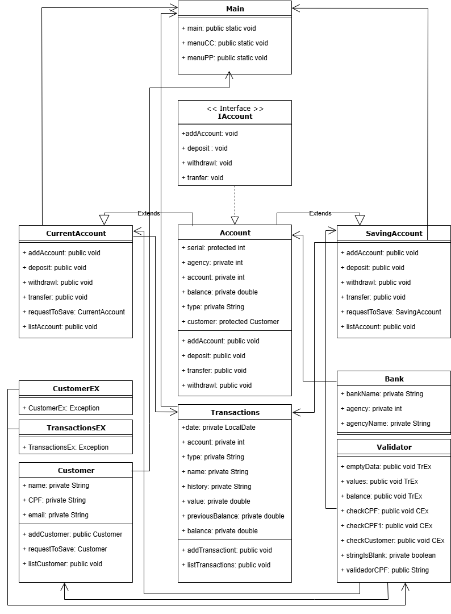

# Criando um Banco Digital com Java e Orientação a Objetos

Criação de projeto de um banco com conta corrente e conta poupança com as operações de abertura de conta, depósito, saque, transferência, extrato movimentações, listar clientes e listar contas.
No projeto foram implementadas validações de valores, validação de dados de clientes, validação de CPF, validação de cliente existente na base e validações para verificar se os Sets e List continham dados. 


## Campos
### Bank

| Campo        | Tipo     | exemplo      | Origem da Informação |
|:-------------|:---------|:-------------|----------------------|
| `name`       | `String` | 33-Santander | `Usuário`            |
| `agency`     | `int`    | 1            | `Usuário`            |
| `agencyName` | `int`    | Centro       | `Usuário`            |
|

### Account

| Campo      | Tipo     | exemplo | Origem da Informação |
|:-----------|:---------|:--------|----------------------|
| `Serial`   | `int`    | 1       | `Aplicação`          |
| `agency`   | `int`    | 1       | `Aplicação`          |
| `Account`  | `int`    | 1       | `Aplicação`          |
| `balance`  | `double` | 500.00  | `Aplicação`          |
| `type`     | `String` | CC      | `Aplicação`          |
| `customer` | `Customer`  | dados   | `Aplicação`          |    


### Customer

| Campo          | Tipo     | exemplo        | Origem da Informação |
|:---------------|:---------|:---------------|----------------------|
| `name`         | `String` | João           | `Usuário`            |
| `CPF`          | `String` | 99999999999    | `Usuário`            |
| `email`        | `String` | joao@gmail.com | `Usuário`            |


### Transactions

| Campo              | Tipo        | exemplo    | Origem da Informação |
|:-------------------|:------------|:-----------|----------------------|
| `date`             | `LocalDate` | 2025.08.21 | `Aplicação`          |
| `Account`          | `int`       | 1          | `Aplicação`          |
| `type`             | `String`    | PP         | `Aplicação`          |
| `name`             | `String`    | João       | `Aplicação`          |
| `history`          | `String`    | depósito   | `Aplicação`          |
| `value`            | `double`    | 1000.00    | `Aplicação`          |
| `previsousBalance` | `double`    | 500.00     | `Aplicação`          |
| `balance`          | `double`    | 1500.00    | `Aplicação`          |

## Fluxograma
```

```

## Linguagens utilizadas
- Java Versão 21.0.7

## Referências

- [DIO - Trilha Java básico](https://github.com/digitalinnovationone/trilha-java-basico/blob/main/desafios/poo/README.md)


## Autores

- [@Anderson-G-Silva](https://github.com/Anderson-G-Silva)


