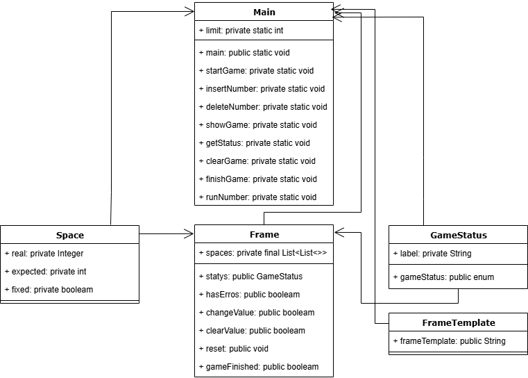
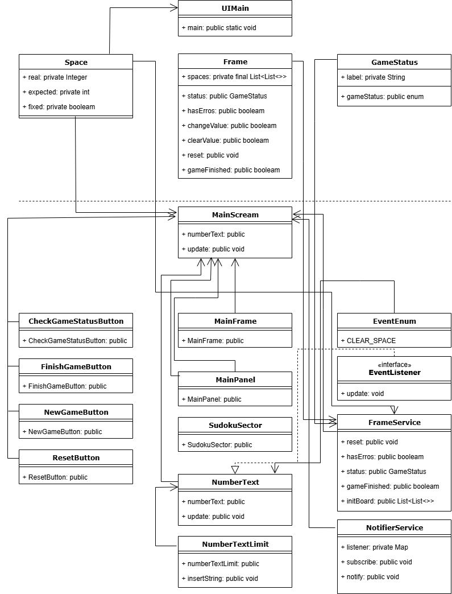

# Criando um Banco Digital com Java e Orientação a Objetos

Criação de projeto para projeto de jogo de Sudoku de 9 posições. 
Implementação da composição do quadro de forma aleatória permitindo várias possibilidades de jogos e níveis de dificuldade diferenciados

## Campos
### Space

| Campo      | Tipo      | exemplo | Origem da Informação |
|:-----------|:----------|:--------|----------------------|
| `real`     | `Integer` | 1       | `Aplicação`          |
| `expected` | `int`     | 1       | `Aplicação + args`   |
| `fixed`    | `int`     | Centro  | `Aplicação + args`   |
|

### GameStatus

| Campo      | Tipo       | exemplo       | Origem da Informação |
|:-----------|:-----------|:--------------|----------------------|
| `labek`    | `String`   | Jogo iniciado | `Aplicação`          |

## Fluxograma
### Fluxograma Java

### Fluxograma interface Java Swing

## Linguagens utilizadas
- Java Versão 21.0.7

## Referências
- [DIO - Sudoku](https://github.com/digitalinnovationone/sudoku)
- [DIO - Trilha Java básico](https://github.com/digitalinnovationone/exercicios-java-basico/blob/main/projetos/2%20-%20Programa%C3%A7%C3%A3o%20Orientada%20a%20Objetos%20e%20Estruturas%20de%20Dados%20com%20Java.md)

## Autores

- [@Anderson-G-Silva](https://github.com/Anderson-G-Silva)

